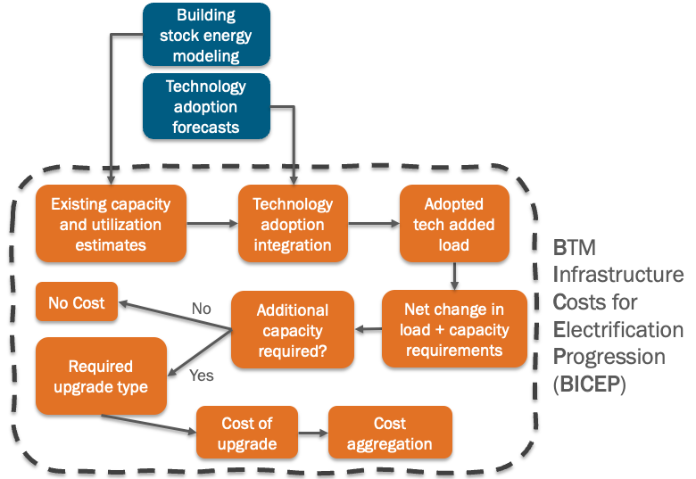

# Behind-the-meter Infrastructure Costs for Electrification Progression (BICEP) model

This repo contains the code for the BICEP model. It is part of EERE's Decarbonizing Energy through Collaborative Analysis of Routes and Benefits (DECARB) Task 5: Estimating Electrical Distribution System and behind-the-meter (BTM) Costs

BICEP is a probabilistic model that provides a granular estimation of existing electrical capacity and the required additional capacity for the 
various decarbonization technologies in the DECARB scenarios based on the net change in load on a per-customer basis.

The model leverages data products from other DECARB tasks, primarily those estimating high resolution spatial 
and temporal demand load profiles: ResStock, ComStock, Scout, dGEN, ReEDS, and TEMPO. 
ResStock/ComStock outputs are used to estimate existing building electrical capacity and the 
load associated with the building decarbonization technologies. Adoption forecasts for the various 
technologies are sourced from the other models.

## Notice

This material was prepared as an account of work sponsored by an agency of the United States Government.  Neither the United States Government nor the United States Department of Energy, nor Battelle, nor any of their employees, nor any jurisdiction or organization that has cooperated in the development of these materials, makes any warranty, express or implied, or assumes any legal liability or responsibility for the accuracy, completeness, or usefulness or any information, apparatus, product, software, or process disclosed, or represents that its use would not infringe privately owned rights.
Reference herein to any specific commercial product, process, or service by trade name, trademark, manufacturer, or otherwise does not necessarily constitute or imply its endorsement, recommendation, or favoring by the United States Government or any agency thereof, or Battelle Memorial Institute. The views and opinions of authors expressed herein do not necessarily state or reflect those of the United States Government or any agency thereof.

   

   <pre style="align-text:center;font-size:10pt">
   PACIFIC NORTHWEST NATIONAL LABORATORY
   *operated by*
   BATTELLE
   *for the*
   UNITED STATES DEPARTMENT OF ENERGY
   *under Contract DE-AC05-76RL01830*
   </pre>
   

## License

Released under the 2-Clause BSD license (see License.txt)