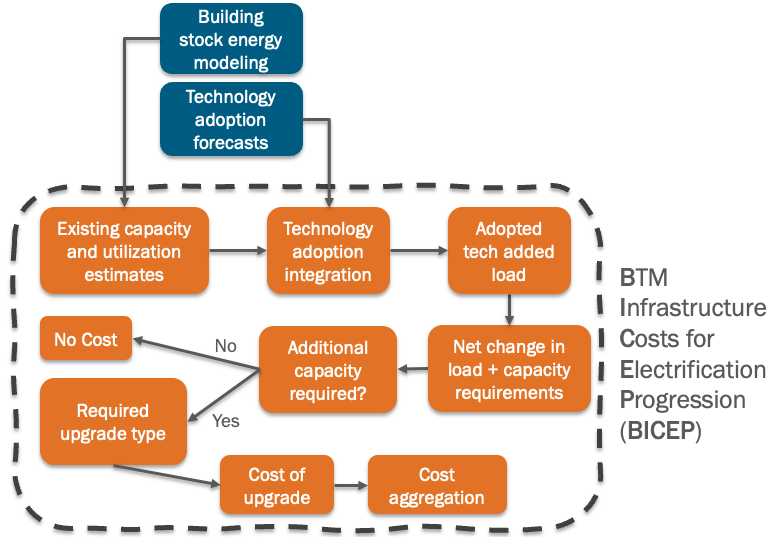

# BICEP Methodology

This page provides an overview of the BICEP model methodology. For complete details, please refer to our IEEE paper:

> Yoder, T., Van Dyke, I., Mott, A., & Esaki-Kua, L. (2025). "Estimating Behind-the-Meter Infrastructure Costs for Technology Adoption." *IEEE Power and Energy Society General Meeting 2025*.

## Overview

BICEP is a **probabilistic model** that estimates behind-the-meter (BTM) electrical infrastructure upgrade costs required under various energy scenarios. The model evaluates costs on a per-customer basis, which can then be aggregated to state and national levels.

### Key Innovation

Unlike previous studies that use broad-brush fuel substitution approaches, BICEP:
- Uses detailed building energy models to estimate actual load changes
- Accounts for building-specific factors (envelope, equipment efficiency, existing systems)
- Provides probabilistic rather than deterministic estimates
- Operates at granular (per-building) scale

## Model Framework



The BICEP methodology consists of four main components:

## 1. Existing Capacity and Utilization Estimates

### Challenge
No comprehensive dataset exists for existing electrical infrastructure capacity in US buildings. Surveys like RECS and CBECS don't include electrical capacity data.

### BICEP Solution
Estimates capacity from building electrical load data using **National Electric Code (NEC) Section 220.87**:

- Extracts peak demand from ResStock [1]/ComStock [2] building energy models (~885,000 buildings)
- Applies NEC-required 125% safety factor to peak demand
- Converts peak power to current using assumed voltages:
  - Residential: 240V
  - Light commercial: 480V  
  - Large commercial: 12,470V (medium voltage)
- Estimates installed capacity using empirical panel utilization distributions

### Data Processing
- Azure Batch jobs process individual building parquet files
- Peak electrical loads stored in SQL database with building metadata
- Panel utilization factors derived from empirical residential survey data

## 2. Technology Adoption Forecasting

**Note:** The datasets and forecasts used in this documentation are for illustrative purposes only. The BICEP tool is intended to be run on any arbitrary technology time series projection. To use your own forecasts, you only need base and end years along with the stock count at those times.

BICEP incorporates four key technologies with adoption forecasts from sector models:

### Heat Pumps (HP) and Heat Pump Water Heaters (HPWH)
- **Source**: Scout model [3] + ResStock [1]/ComStock [2]
- **Method**: Conditional probability conversion using existing equipment types
- **Load Impact**: Uses End-Use Load Profiles (EULP) upgrade scenarios to calculate actual peak demand differences

### Solar Photovoltaic (PV)
- **Source**: ReEDS model [4] (regional capacity forecasts)
- **Method**: 
  1. Estimate building-specific PV sizes using empirical size distribution
  2. Iteratively sample buildings until regional capacity targets are met
- **Load Impact**: PV capacity converted to current requirements at building voltage

### Electric Vehicles (EV)
- **Source**: TEMPO model [5] (vehicle count forecasts)
- **Method**:
  - Commercial: Parking spaces per 1000 sq ft × % EV spaces
  - Residential: Vehicles per housing unit distribution
  - Assumes Level 2 chargers (fixed current requirement)
- **Load Impact**: Number of chargers × charger current requirement

### Iterative Adoption Algorithm
For PV and EV, BICEP uses an iterative sampling approach:

```python
forecast = get_technology_forecast()
epsilon = forecast * 0.01  # 1% tolerance
estimate = 0

while (forecast - estimate) > epsilon:
    building = select_random_building()
    building.tech_adopted = True
    estimate += building.tech_capacity * building.weight
```

## 3. Capacity Requirements and Upgrade Determination

### Total Additional Capacity
Sum of capacity requirements for all adopted technologies:

**Total Required = HP + HPWH + PV + EV capacity requirements**

### Upgrade Decision
Upgrade required when:

**Required Additional Capacity > Available Spare Capacity**

Where:
- **Available Spare Capacity** = Estimated Installed Capacity - Current Peak Demand × 1.25

## 4. Upgrade Cost Estimation

### Cost Distributions
Due to limited empirical data, costs are drawn from probability distributions:

- **Residential**: Lognormal or Fréchet distributions ($0 - $35,000 range) [6]
- **Commercial**: Lognormal or Fréchet distributions ($0 - $350,000 range) [6]
- Both distributions are right-skewed to capture higher frequency of lower-cost upgrades

### Cost Adjustments
- **Location factors**: State-specific cost multipliers applied
- **Temporal factors**: 
  - Costs escalated to future value using inflation rate
  - Present value calculated using discount rate
  - Equivalent annual costs calculated for comparison

### Probabilistic Approach Benefits
- **Empirical data integration**: Uses real-world panel utilization data where available
- **Uncertainty quantification**: Provides cost ranges rather than point estimates
- **Flexible assumptions**: Easy to modify distributions as new data becomes available

## Model Validation

### California Case Study
- **BICEP estimate**: $954 million (3% discount rate) [8]
- **Literature range**: $30 million - $2.3 billion [7]
- Results align well despite different methodological approaches

### Key Insights
Analysis reveals technology-specific drivers:
- **EVs**: Largest driver of required upgrades in California
- **Heat pumps/HPWHs**: Lower upgrade requirements due to efficient replacement of existing electric systems

## Limitations and Future Work

### Current Limitations
- Medium/heavy-duty vehicle charging not included
- Industrial sector excluded due to bespoke upgrade requirements
- Some distributions based on limited empirical data

### Planned Improvements
- Integration of MHDV charging infrastructure
- Enhanced location-based cost adjustments
- Calibration of distributions as new empirical data becomes available

## Implementation

The BICEP model is implemented in Python and available as open-source software. Key features:

- **Modular design**: Each methodology component is a separate module
- **Scalable processing**: Cloud-based data processing for large datasets
- **Flexible scenarios**: Easy to modify technology adoption forecasts
- **Multiple outputs**: State, regional, or national cost aggregation

For implementation examples, see our [Examples](examples/) section.

## References

[1] NREL. (2024). *ResStock General Reference Documentation.* National Renewable Energy Laboratory. [https://nrel.github.io/ResStock.github.io/](https://nrel.github.io/ResStock.github.io/)

[2] Parker, A., Henry, H., Horsey, H., Craig, M., et al. (2023). *ComStock Reference Documentation.* NREL/TP-5500-83819. National Renewable Energy Laboratory. [https://www.nrel.gov/docs/fy23osti/83819.pdf](https://www.nrel.gov/docs/fy23osti/83819.pdf)

[3] Harris, C., Langevin, J., Roth, A., Phelan, P., Parker, A., Ball, B., et al. (2021). "Scout: An Impact Analysis Tool for Building Energy-Efficiency Technologies." *ACEEE Summer Study on Energy Efficiency in Buildings.* [https://scout-bto.readthedocs.io/](https://scout-bto.readthedocs.io/)

[4] Ho, J., Becker, J., Brown, M., et al. (2021). *Regional Energy Deployment System (ReEDS) Model Documentation: Version 2020.* NREL/TP-6A20-78195. National Renewable Energy Laboratory. [https://doi.org/10.2172/1788425](https://doi.org/10.2172/1788425)

[5] Muratori, M., Jadun, P., Bush, B., et al. (2021). *The Transportation Energy and Mobility Pathway Options (TEMPO) Model.* NREL/TP-5400-80306. National Renewable Energy Laboratory. [https://doi.org/10.2172/1823026](https://doi.org/10.2172/1823026)

[6] NV5 and Redwood Energy. (2022). *PG&E Service Upgrades for Electrification Retrofits Study Final Report.* Pacific Gas and Electric Company.

[7] Kenney, M., et al. (2021). *California Building Decarbonization Assessment.* California Energy Commission. CEC-400-2021-006-CMF.

[8] Economic assumptions: 3% discount rate, 25-year equipment lifespan for present value calculations.